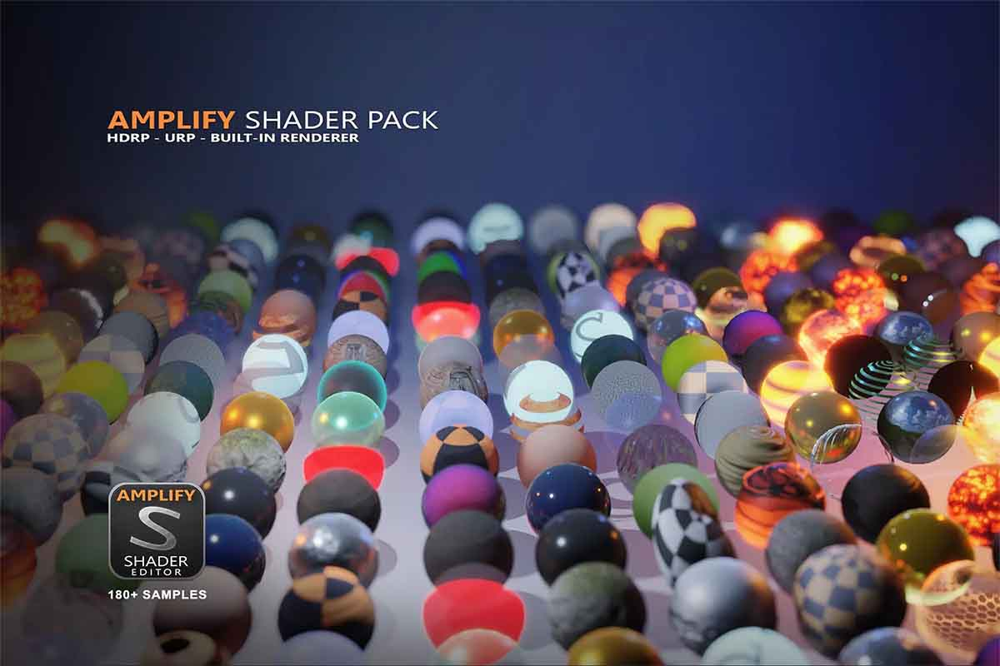
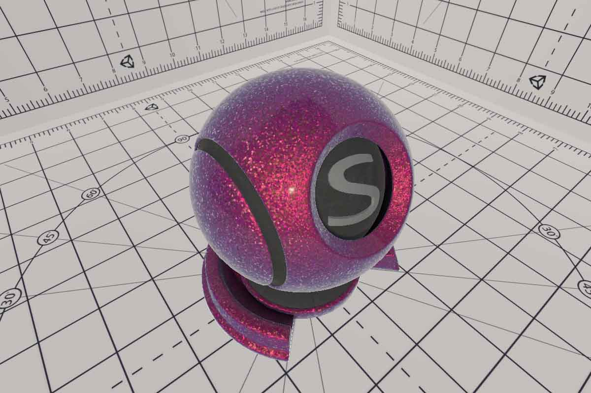

# 中文博客

## Unity Shader

- [Amplify Shader Pack 中文手册](/blogs/ase)，这里是我对 ASE 手册的翻译。

- [车漆渲染（更新中）](/blogs/carpaint)，介绍如何用 ASE 渲染车漆涂层。

# 深度学习

- [Pytorch 环境搭建](/blogs/buildpytorch)

## 工具

- [Oculus Quest2 如何注册](/blogs/quest2)

# Chinese Blogs

## Unity Shader

- [Amplify Shader Pack Chinese Manual](/blogs/ase), Here I translated the ASE manual.

- [Car Paint(Updating)](/blogs/carpaint), It shows how to render a car coat with ASE.

# Deep Learning

- [Pytorch 环境搭建](/blogs/buildpytorch)

## Tools

- [Oculus Quest2 如何注册](/blogs/quest2)

