# Amplify Shader Editor Manual

* awsl
{:toc}

## 安装

1. 打开 AmplifyshaderEditor###.unitypackage
2. Unity会显示“Importing package”的窗口，选择所有，然后导入。
3. ASE将会被安装在Unity的工程中，文件结构如下：
      YourProject\Assets\AmplifyshaderEditor\
      YourProject\Assets\AmplifyshaderEditor\Examples\
      YourProject\Assets\AmplifyshaderEditor\Plugins\

## 糟糕！我的Shader都是全粉色

不要慌，shader显示粉色是因为Unity为了想让你知道Shader没有正常工作或者配置。
1. 渲染中你使用了错误的shader类型
   在URP，HDRP和 SRP出现之前，您不需要在项目中指定特定的着色器类型，所有项目都使用了内置（build-in）渲染器着色器。这些旧的着色器通常包括：Built-in, Legacy, Surface Shaders, or Standard。在某些情况下，它们不能与新的渲染管道兼容；除了UI或Sprite着色器，它们仍然使用以前的着色器。
   要确保使用的是兼容的URP或HDRP着色器渲染管线类型，请在输出节点参数中检查类型名称；着色器类型总是在其前缀中，明确地说明它们属于渲染管线。
   有关如何使用ASE设置SRP的其他说明，请查看相关页面：Scriptable Rendering Pipeline

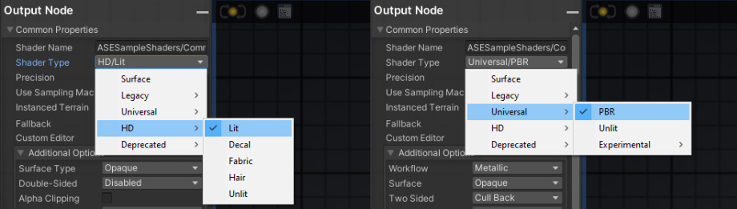

2. 有一个着色器错误，导致它无法按预期执行。检查控制台和ASE控制台线索；加入我们的[Discord]（https://discord.gg/zVdqVSp）如果您不能知道问题，如果您认为您发现了可能的错误，请通过support@amplify.pt联系我们。

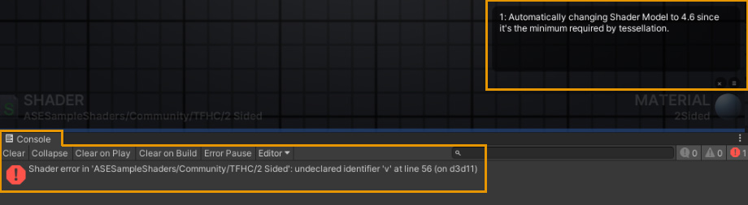

## 编辑器

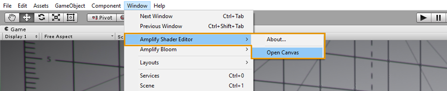 

打开ASE窗口，停靠它，在一个单独的窗口或者显示器中使用。当您双击ASE材质或shader时，该编辑器将自动打开。

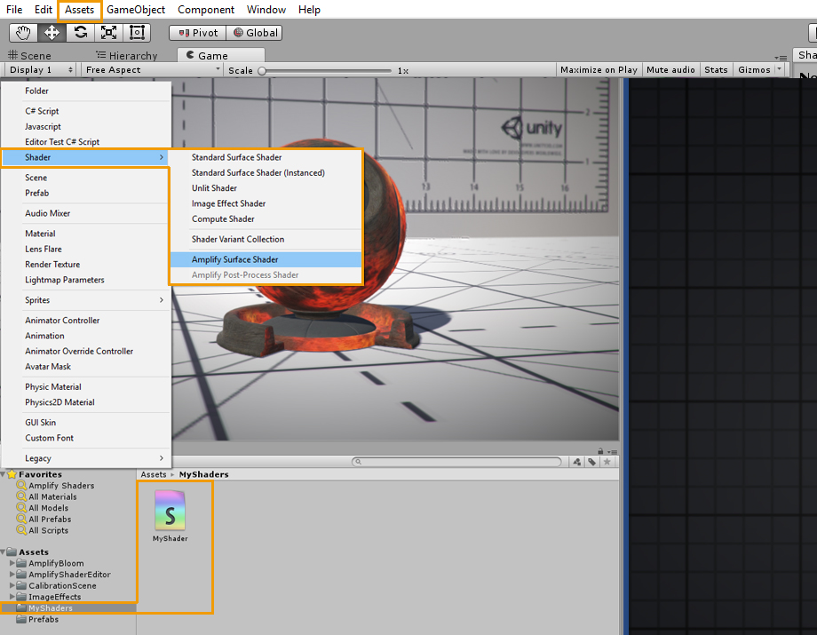 

ASE Shader可以直接在项目选项卡中创建，或者通过Assets > Create > Shader > Amplify Surface Shader进行创建。
资产>创建>着色器>放大表面着色器下的菜单创建。

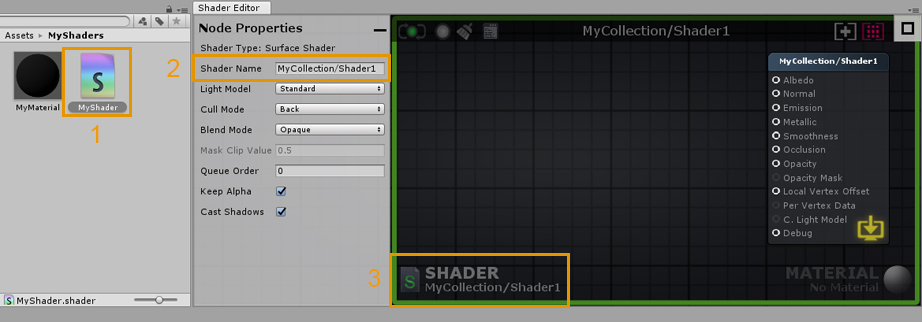

1. 双击一个ASE Shader，将在ASE窗口中打开它。或者，您可以通过单击“Open in Shader Editor”按钮，在"inspector"的选项卡中打开着色器。
2. 直接在“Node”选项卡中命名着色器，可以使用正斜杠（/）分隔符添加自己的类别。请记住，着色器文件名是唯一的，必须在“项目资源管理器”选项卡中手动设置。您可以对文件和实际的Shader使用不同的名称。
3. 此区域显示当前的Shader，单击它将在“Project ”选项卡中找到并选择该Shader。注意绿色的轮廓，这是一个视觉辅助，让你知道目前只有Shader是打开的。

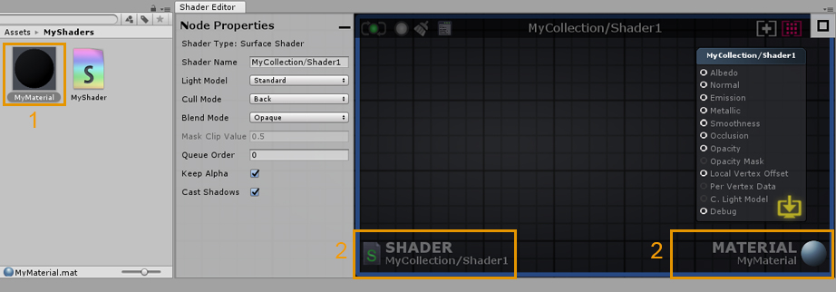

1. 双击使用ASE Shader的材质，以同时在ASE窗口中的打开Shader和Material。或者，你可以在材质检查器选项卡中，单击“open in shader editor”按钮直接在打开它。
2. 通过打开material，激活shader和material都将显示在窗口的下面区域。与shader一样，单击它将在“项目浏览器"选项卡中找到并选择material。注意窗口蓝色的轮廓，这是一个视觉辅助工具，让你知道shader和material当前都是打开的。

## 窗口UI交互

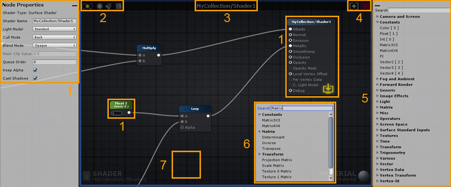 

1. 可以在左侧选项卡中调整节点属性。选择一个节点，或output节点，以显示其参数。有些值可以在实际节点中直接调整。如果没有选择任何节点或选择了多个节点，则output节点的属性总是显示在此选项卡上。output节点属性选项卡可以通过单击选项卡的右上角的减号按钮来最小化。（jack: 新版的为output node）

2. 最小化的保存/更新/清除/编辑按钮。不可用或禁用时为灰色，最新时为绿色，过时时为黄色。
  - 按钮1：手动着色器更新（保存和更新）
  - 按钮2：切换LIVE shader更新（自动保存和更新）
  - 按钮3：删除已断开连接的节点
  - 按钮4：在文本编辑器中打开shader

3. 着色器的类别和名称。 

4. 画布视图的调整。(jack: 新版的按钮多一些)
	- 按钮1：选择并关注输出节点。
	- 按钮2：关注选定的节点。如果未选择任何内容，将关注整个节点集合。自动变焦也可以通过双击按钮或双按“F”键来完成。
	
5. 节点选项板选项卡是一个可搜索的节点列表，您可以选择并将节点直接拖动到窗口区域上。可以通过单击选项卡左上角的减号按钮来最小化节点选项板选项卡。

6. 右键单击画布上的任何位置以显示可搜索的节点列表，单击节点名称以创建它。

### 分享内容

在版本v1.6.8.002中，你现在可以使用相机按钮拍摄你的着色器的完整画布截图。此外，您还可以通过使用链接共享按钮, 将链接直接复制和粘贴到画布中来共享节点。

 

7. 按住快捷键并单击画布上的任意位置以创建新节点。快捷键显示在[ ]中，位于选项卡上它们各自的节点名称的前面（jack:实际是后面）。例如：键“1”表示浮点，键“5”表示颜色节点。

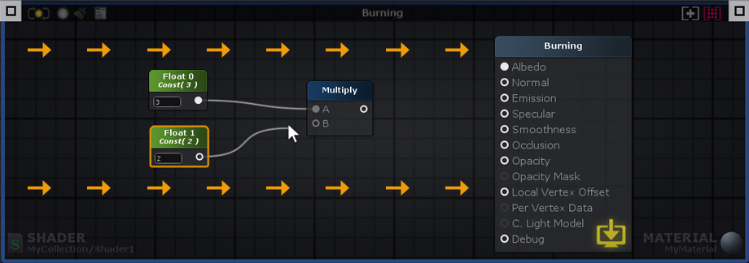

数据从左向右流，过程为：输入端口>处理的数据>输出端口。系统只分析直接或间接连接到output节点的节点，并用于生成最终的着色器指令。如果一个节点包含了未连接的输入端口，则ASE将在处理阶段使用内部参数。内部参数值可以通过节点属性选项卡进行编辑。

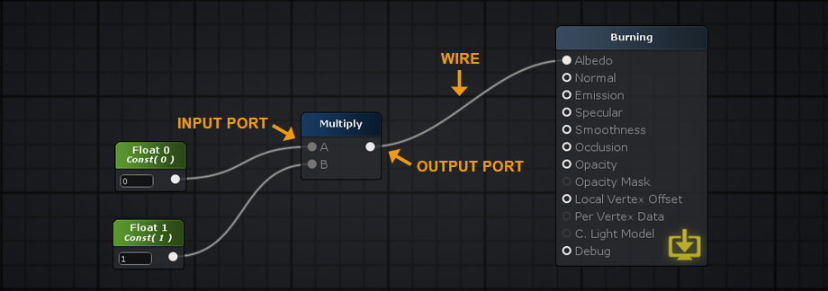 

**Nodes（节点）** 节点可以通过鼠标左键单击节点或用鼠标左键拖动选择框来选择节点。通过按住“Shift”键并单击它，可以从选择中附加或删除节点。按“CTRL/CMD+A”来选择所有内容。通过鼠标左键单击节点画布上的空白区域取消选择所有内容。通过按住鼠标左键并拖动来移动选定的节点。

**Wires（线）** 删除连线，按住“Alt”键并单击节点端口或拖动连接到画布的空白区并左键单击。连接到选定节点的连线被高亮显示，表示从最左边节点到最右边节点的数据流。

**Connections(连接)** 通过左键单击并拖动线从节点的“输出端口”到下一个节点的“输入端口”，或从空的“输入端口”拖拽到“输出端口”来创建连接。鼠标左键按住已连接的输入端口，可将连线断开，按住鼠标，可以将其拖动到另一个输入端口上。将导线拖到空的画布空间上，就会自动出现一个菜单（可以选择不同类型节点），如果选择了一个节点类型，则将使用第一个有效端口进行连接。

**Ports（端口）** 输出端口可以连接到多个输入端口，但输入端口仅接受单个输入。线会自动捕捉到鼠标光标附近端口。为了便于使用，端口激活区域非常大，甚至可以将线直接放到端口名称上。

**View(视图)** 按鼠标右键或中键拖动以平移视图。当框选定节点，或者选择的节点远离可见工作区区域时，画布将自动滚动。可以通过鼠标滚动轮进行放大/缩小。缩小的幅度由画布上的节点位置动态确定。

**Tabs（标签栏）** 当将ASE窗口宽度减小到750px以下时，选项卡上的"节点属性"面板和“选择节点”面板都会自动最小化。你总是可以通过点击矩形按钮来最大化它们。

## Material和Shader模式

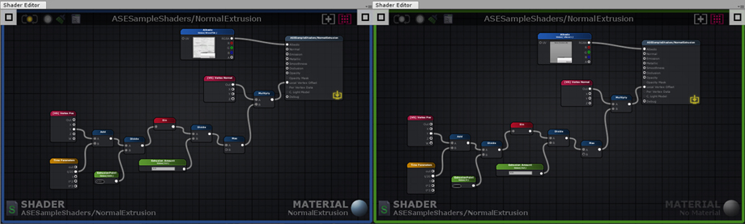 

您可以在Shader/着色器或Material/材质两种模式之一中使用ASE，这取决于您是否从着色器或材质资源加载着色器文件。画布边框作为激活的模式视觉指示器，着色器模式显示绿色轮廓，材质模式显示蓝色轮廓。

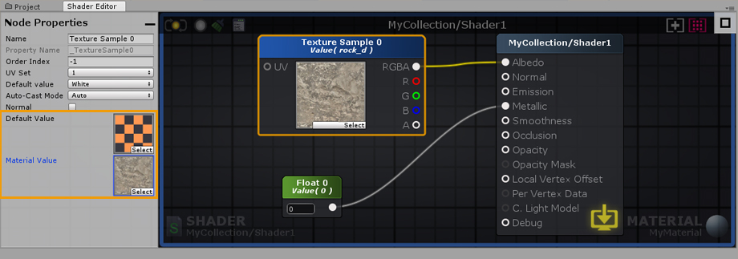 

在着色器中设置的值通常被称为默认值。对任何给定着色器默认值所做的任何更改都将自动影响使用它的所有材质。当同时编辑材质和着色器时，请密切注意那些修改的值。

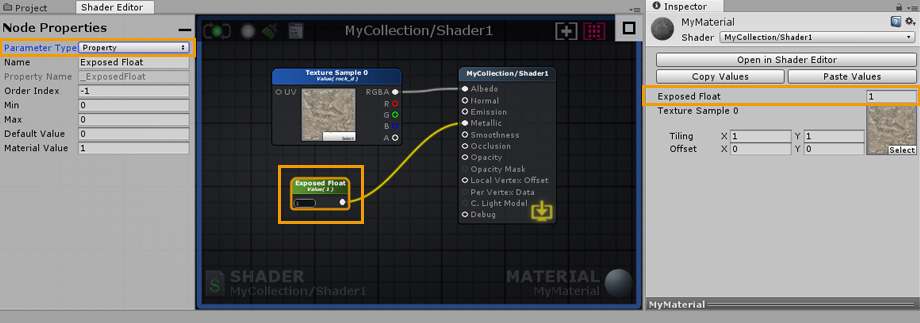

与着色器中的默认值不同，材质中的值可以是唯一的。材质值仅在材质模式（材质和着色器全部打开）下工作时显示，即：这些具有变量（颜色、浮动、Int、向量、矩阵）的节点，在参数类型下拉列表，设置为“属性”时。当选择属性或统一参数类型时，默认值总是被复制到材质值。每个材质都可以进行调整，以创建无限数量的变化，同时仍然使用相同的着色器。您可以将材质视为着色器的实例，每个实例都是唯一的，可以使用相同的默认值集进行创建。

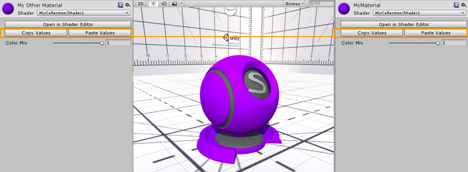 

在使用相同的ASE着色器在材质之间，你可以复制和粘贴属性值。"Open in Shader Editor"按钮提供了一种快速的、可以同时打开材质和着色器的方法。

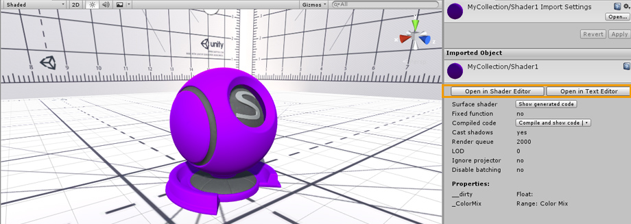 

Shaders可以通过单击着色器“inspector”面板上的“Open in Shader Editor”检查器选项卡直接打开。或者单击“Open in Text Editor”在文本编辑器中打开。

## Output Node (Built-in管线)

**注意** 本节仅作为标准Build-in管线PBR着色器中常见参数的示例。根据所使用的着色器类型，您可能有一组不同的可用参数或完全不同的顺序。如果您正在寻找特定的HDRP或URP信息，一定要检查相关的页面：[Scriptable Rendering Pipeline](http://wiki.amplify.pt/index.php?title=Unity_Products:Amplify_Shader_Editor/Scriptable_Rendering_Pipeline)

本节的部分内容已直接从Unity着色器参考文档中获取。了解更多信息: [Unity Shader Reference](https://docs.unity3d.com/Manual/SL-Reference.html)

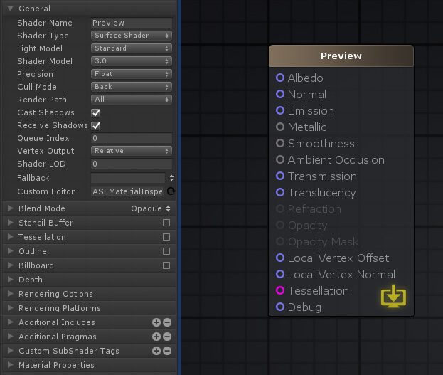

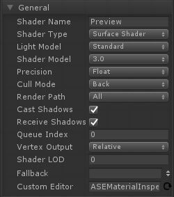

**General**
- Shader Name（着色器名称）: 可编辑的文本框，定义了着色器的名称和路径。使用正斜杠“/”来定义其类别和名称；例如，UserSamples/EnvironmentGradient。注意，此框中显示的名称与文件名不相同，它们必须单独设置。
- Shader Type（着色器类型）: 此区域显示当前所使用的着色器类型。这里包括了所有您在项目中使用的模板。ASE提供了post process effects, particls, sprites, UI和unlit shader.默认设置为surface。
- Light Model(光学模型):定义表面如何反射光线，通常指着色器的类型。ASE目前提供：标准（金属），标准镜面，兰伯特，Blinn-Phong和自定义照明，允许创建一个独特的基于节点的照明模型。
- Shader Model（着色器模型）: 当编写表面着色器或常规着色器程序时，HLSL源代码可以被编译成不同的“着色器模型”。更高的着色器编译目标允许使用更现代的GPU功能，但可能会使着色器不能在较旧的GPU或平台上工作。
- Precision（精度）: 定义内部计算的最大精度，使用较低的类型提供了额外的性能提升，牺牲一些精度；默认情况下，设置为float，这个值会限制了放置在画布中的所有属性值。
- Cull Mode（剔除模式）: Front - 剔除正面, Back - 剔除后面, Off - 关闭剔除(双面材料); 默认使用Back。
- Render Path（渲染路径）: 允许您定义着色器模式（向前/延迟）；默认情况下设置为“所有“。
- Cast Shadows（投射阴影）: 定义着色器是否生成阴影传递，来投射阴影；仍然可以在每个对象的材质渲染器组件中关闭阴影投射。
- Receive Shadows（接受阴影）: 定义使用着色器的对象是否接收阴影；这包括自阴影（仅支持正向渲染）；可以在每个对象的材质渲染器组件中关闭这个功能。
- Queue Index（队列索引）：渲染队列偏移值，正数（靠后）和负数（靠前）。
- Vertex Output（顶点输出）: 默认情况下为相对。可以设置为绝对。输入局部的顶点偏移将自动变为局部顶点位置。
- LOD：默认情况下，允许的LOD级别是无限的，只要用户的硬件支持，即可使用。然而，在某些情况下，您可能想要删除着色器的细节，即使硬件可以支持它们。 [Unity Shader Reference](https://docs.unity3d.com/Manual/SL-ShaderLOD.html)
- Fallback（回退）: 从项目中的可用着色器中设置一个回退着色器，当主要着色器缺少或不支持时，将使用这个回退着色器。
- Custom Editor（自定义编辑器）: 自定义检查器允许您使用自定义材质检查器（inspector），默认情况下使用ASE自定义材质检查器。

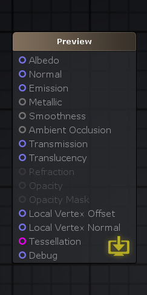

**Standard Shader Inputs**

- Albedo（反照率）: 反照率参数控制着色器表面的基本颜色，可使用颜色值或纹理贴图。 
- Normal（法线）: 法线贴图是一种特殊的纹理，允许添加表面细节。例如，高精度网格、凸起、凹槽和划痕导致的阴影。您可以连接法线贴图或自定义法线向量。
- Emission（发光）: 它控制从表面发出光的颜色和强度。忽略光照条件如何。RGB值作为输入。
- Metallic ( Metallic workflow only 仅金属工作流 ): 使用金属工作流程时，可以通过修改金属度和光滑度来改变表面反射率和光响应。使用灰度输入。可以使用从0到1的数和一个纹理，来控制金属值，不同区域使用不同的金属值。参数0是电介质（非金属）和1是全金属。
- Specular ( Specular workflow only 仅镜面工作流 ): 使用镜面工作流时，镜面参数RGB颜色控制着镜面反射率的强度和色调。
- Smoothness ( Both workflows两个工作流都支持 ): 平滑度的概念适用于镜面工作流和金属工作流，在这两种工作流中非常相同；灰度作为输入。当值为1时为完全光滑表面，提供清晰的反射。当是粗糙表面时，设置为0，产生漫反射颜色，没有清晰的反射。在一些引擎中，会使用“粗糙度”。
- Ambient Occlusion（环境遮挡）: 遮挡输入可以是：遮挡纹理贴图，或自定义值。表示来自环境照明和反射，模型区域高或低间接照明。遮挡纹理是一个灰度的图片，白色区域表示应该接受完全间接照明，而黑色区域表示没有间接照明。
- Transmission（透射）: 透射是一种高度优化的近似光散射的方法。换句话说，它定义了从后面照明时，有多少光线通过一个表面。这对于不细节的资产非常理想。如树叶、布，甚至是蜡质物体。RGB可以作为输入。
- Translucency（半透明）: 半透明输入，通过控制光法线角度衰减偏移，以简单和优化的方式显示SSS（子表面散射）效果。通常用于皮肤效果，因为足够灵活也可用于其他用途。接受完整的RGB输入。
- Refraction ( Transparent Render Type  折射，透明渲染 ): 使用折射输入，需要一个着色器把渲染类型设置为透明。用于模拟通过玻璃或水等介质看到的物体的变形效果。方法是通过折射背景像素的屏幕空间UV偏移来实现的。接受完整的RGB输入。这是一种简单的模拟光现象技术，即当光波从一个给定折射率的介质斜角传播到另一个介质时折射。
- Opacity ( Transparent Render Type )不透明度（透明渲染类型）: 使用不透明度输入时，需要将着色器的渲染类型设置为透明（transparent），设置表面的透明度。当值范围为0到1，从完全透明到完全不透明。接受完整的RGB输入。
- Opacity Mask ( Transparent Render Type ) 不透明蒙版（透明渲染类型）：不透明度蒙版需要将渲染类型设置为透明（transparent）或屏蔽混合(Masked Blend)模式。工作方式类似于不透明度，其值介于0到1之间，从完全透明到完全不透明，但不考虑中间值。特定表面区域完全可见或完全不可见。对于定义复杂固体表面的材料，如钢丝网或链杆，这是完美的解决方案。不透明部分仍然遵守照明规则。接受灰度输入。
- Local Vertex Offset ( Relative Vertex Output )局部顶点偏移（相对顶点输出）：局部顶点偏移输入可用于通过顶点操作改变表面的形状。其中XYZ坐标，将定义每个顶点将如何从其相对位置偏移。
- Local Vertex Position ( Absolute Vertex Output ) 局部顶点位置（绝对顶点输出）:局部顶点位置的工作方式类似于局部顶点偏移输入。但是，它不使用每个顶点的相对位置偏移，而是在绝对世界空间方向上偏移顶点。
- Local Vertex Normal（局部顶点法线）: 局部顶点法线允许调整任何偏移曲面的法线方向。网格的法线不实时计算。这一过程通常被称为法线重建。
- Tessellation（细分）: 细分输入允许对网格的三角形进行细分，在运行时将它们分割成更小的三角形，以增加任何给定网格的表面细节。
- Debug （调试）: 调试输入生成一个预览着色器，忽略所有其他激活输入，只绘制debug插入，而不考虑照明。请注意并非所有的节点或特定的组合，都可以在debug模式下进行预览。

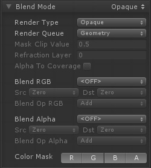

**Blend Mode(混合模式)**

- Blend Mode（混合模式）: 选定模式自动调整可用参数：例如不透明、遮罩、透明度、半透明、Alpha预乘法或自定义。
- Render Type（渲染类型）: 渲染类型标签可以将着色器分类为几个预定义的组；不透明的着色器，或经过alpha测试的着色器。可用的标签有：不透明，透明，透明切割，背景，覆盖，树不透明，树透明切割，树广告牌，草和草广告牌。
- Render Queue（渲染队列）: 几何体渲染队列优化了对象的绘图顺序，以获得最佳性能。渲染队列按距离对对象进行排序，从最远的对象开始渲染，然后以最近的对象结束。可用的选项：背景，几何体，Alpha测试，透明和覆盖。通过分层系统，每个后续队列都在前一个队列完成后渲染。
- Mask Clip Value（蒙版切割值）: 要与不透明度alpha进行比较的默认值。0完全不透明，1完全屏蔽；默认情况下设置为0。通常用于透明切割材料。
- Refraction Layer（折射层）: 特殊的grabpass将被此值抵消时，有效地为折射效果创建分层系统。
- Alpha To Coverage（Alpha覆盖）: 打开内部MSAA功能，混合不透明对象和alpha对象；仅用于打开MSAA的正向渲染可用。
- Blend RGB and Blend Alpha（混合RGB和混合Alpha）: 当图形被渲染后，在所有的着色器都被执行和所有的纹理都被应用后，像素就会被写入屏幕上。它们如何与已经存在的东西结合起来是由混合命令控制的。ASE目前提供了一个自定义的、Alpha混合模式、预乘法模式、加性模式、软加性模式、乘法模式和一个2倍乘法模式。
- Blend Factors (SrcFactor & DstFactor)混合因子（Src因子和Dst因子）:以下所有属性对“混合”命令中的“Src因子和Dst因子”都有效。Src是指计算出的颜色，Dst是已经在屏幕上的颜色。如果通过BlendOp使用逻辑操作，则会忽略混合因子。 
  - One：1 - 使用src或dst颜色完全通过。
  - Zero:  0 - 用它来删除src或dst值。
  - SrcColor: 乘以src的颜色值.
  - SrcAlpha: 乘以src的Alpha值.
  - DstColor: 乘以帧缓冲区Dst颜色值
  - DstAlpha: 乘以帧缓冲区Alpha值
  - OneMinusSrcColor: 乘以(1 - source color).
  - OneMinusSrcAlpha: 乘以(1 - source alpha).
  - OneMinusDstColor: 乘以 (1 - destination color).
  - OneMinusDstAlpha: 乘以 (1 - destination alpha).
  - Blend Op RGB & Blend Op Alpha: Add, Sub, Rev Sub, Min and Max
- Color Mask: 设置颜色管道写入掩模, 开启OFF后不可见.

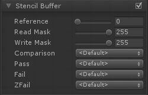

**Stencil Buffer（模板缓冲区）**

可以用模板缓冲区的每个像素掩码来决定保存或丢弃像素。每个像素是一个8位整数。该值可以写入、递增或递减。后续的绘制调用可以对该值进行测试，以决定在运行像素着色器之前是否应该丢弃这个像素。当Cull模式设置为OFF时，为了正面和背面使用缓冲区，菜单会添加一组额外的比较选择选项。

- Reference（参考）: 要Comp进行比较的值，比较后要写入缓冲区的值（设定不同条件：Pass, Fail,和ZFail）。可以是0-255的整数。
- Read Mask（读掩码）: 8位掩码为0-255整数，用于比较引用值和缓冲区内容（referenceValue & readMask）和（stencilBufferValue & readMask）。默认值：255。
- Write Mask（写入掩码）:  8 位掩码，0–255 integer。可以写入缓冲区。默认值：255。
- Comparison (front and back) 比较前后: 用于比较参考值与缓冲区当前内容的函数。默认值：always。
- Pass (front and back):  如果模板测试（和深度测试）通过，则如何处理缓冲区中的内容。默认值: keep。
- Fail (front and back): 如果模板测试失败，如何处理缓冲区的内容。默认值：keep。
- ZFail (front and back): 如果模板测试通过，但深度测试失败，则如何处理缓冲区中的内容。默认值：keep。

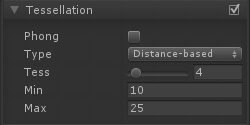

**Tessellation(细化)**

- Phong: 修改细分面的位置，使生成的表面符合网格法线方向；默认设置为OFF。强度：0-1
- Type: 定义所使用的技术；基于距离、固定、边长度和Edge Length Cull
- Tess: 镶嵌因子; 1-32.
- Min:  最小镶嵌距离.
- Max: 最大镶嵌距离.
- Edge Length: 在开始镶嵌之前，可以有的最大长度。
- Max Disp: 多边形补丁处的最大边界外位移 

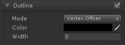

**Outline （轮廓线）** 使用反外壳技术，创建一个自定义的轮廓效果
- Mode:  Vertex Offse: 通过值的大小控制; Vertex Scale:通过顶点比例增加来调节  
- Color: 用于定义轮廓的颜色。
- Width: 要被偏移或缩放的值。

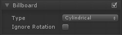

**Billboard (广告牌)**
- Type: 圆柱形广告牌只能在Y轴上旋转。一个球形广告牌会朝向相机旋转，而不管它的如何旋转。
- Ignore Rotation: 设置ON，忽略公告牌旋转。

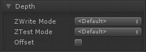

**Depth（深度）**
- ZWrite Mode: 控制对象的像素是否写入深度缓冲区（默认打开）。如果绘制实体对象，请设置ON。如果你绘制半透明的效果，切换到ZWrite Off。有关更多细节，请阅读下文。
- 
- Controls whether pixels from this object are written to the depth buffer (default is On). If you’re drawing solid objects, leave this on. If you’re drawing semitransparent effects, switch to ZWrite Off. For more details read below.
- ZTest Mode: How should depth testing be performed. Default is LEqual (draw objects in from or at the distance as existing objects; hide objects behind them). ASE provides ZTest Less, Greater, LEqual, GEqual, Equal, NotEqual and Always.
- Offset: Allows you specify a depth offset with two parameters. factor and units. Factor scales the maximum Z slope, with respect to X or Y of the polygon, and units scale the minimum resolvable depth buffer value. This allows you to force one polygon to be drawn on top of another although they are actually in the same position. For example Offset 0, –1 pulls the polygon closer to the camera ignoring the polygon’s slope, whereas Offset –1, –1 will pull the polygon even closer when looking at a grazing angle.
- - Factor: Scales the maximum Z slope, with respect to X or Y of the polygon.
- - Units: Units scale the minimum resolvable depth buffer value.

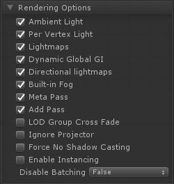

**Rendering Options**
Here it's possible to activate or deactivate certain shader features, by the default most of them will be ON to mimic Unity's standard shader.

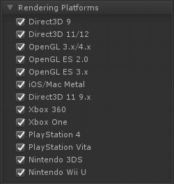

**Rendering Platforms**
Defines which platforms are supported; set to All by default.

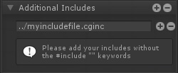

**Additional Includes**
Allows a definition of a relative path from the shader for a cg include file. If the file is missing or the path incorrect it will fail to compile the shader. "../" can be use to go down a folder.

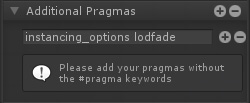

**Additional Pragmas**
Allows the addition of individual pragma directives to control the compilation and rendering of the shader.

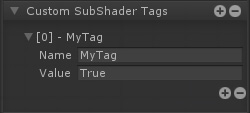

**Custom SubShader Tags**
Allows the addition of custom subshader tags for custom shader rendering control.

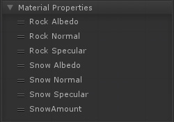

**Material Properties**
Variables set to Property will be listed in this section, you tweak their position by dragging them.

### Referencing Custom Properties

Certain shader options, like Cull Mode or Stencil, can also be configured by shader properties, Ints and Floats to be specific, instead of their usual predefined values. 

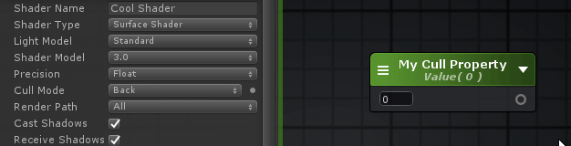 

These will have a clickable Dot present on the side of the drop-down box, which you may use as a toggle in order to activate the new property select mode for selecting your own properties through the shader option's list. 

## Shader Functions

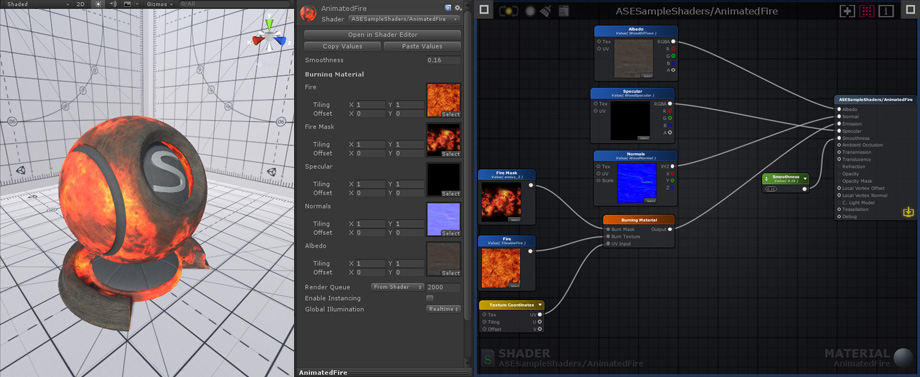

Shader Functions, SF for short, are individual node networks that allow you to build reusable functions. Easy to setup and extremely flexible, they work by receiving input values directly from your shader, processing that information and outputting them back for further alterations or direct use. SF assets are not bound to any shader, you can use them multiple times throughout your project, in the same shader, inside other Shader Functions, or even share them with other users. From simple to complex graphs, Shader Functions are a great way to reduce canvas clutter by packing complex networks into single nodes, and a great way to eliminate unnecessary repetitive tasks; they can be considered a form of "grouping", that offers you a way to group nodes into more manageable assets. **Would you like to share your creations with the ASE community?** [Contribute here!](http://amplify.pt/unity/amplify-shader-editor/contribute/) 

### Features
- Works with all ASE nodes.
- Configurable Input/Output nodes.
- Copy & Paste nodes between shaders and SF.
- Supports all variable types, including Material Properties.
- Reusable and unique assets, not bound to any shader or project.
- Seamless editor workflow, drag & drop into any open shader or add them from the Node list.

### Comparison

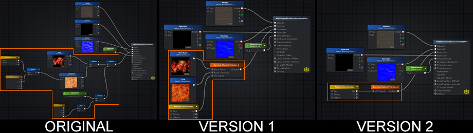 

The node networks above all produce the same burning effect. The **original** version does not use shader functions. **Version 1** uses a SF that contains the original node network used to generate the burning effect, it receives 1 Texture Object node for the burn mask, 1 Texture Object node for the fire texture, and 1 Texture Coordinate node. **Version 2** is simpler than the previous example, the burn effect generation and texture nodes are all included in the SF, the only exception being the Texture Coordinate node that allows users to tweak its behavior. Keep in mind that a SF does not need to receive any input, the outputted data can be entirely generated in its graph if necessary.
**Version 1 Shader Function Example**

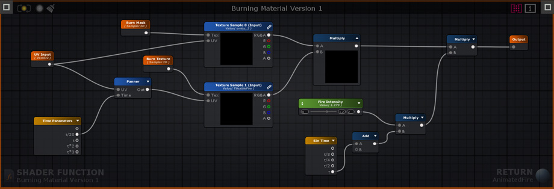

### Creation and Usage

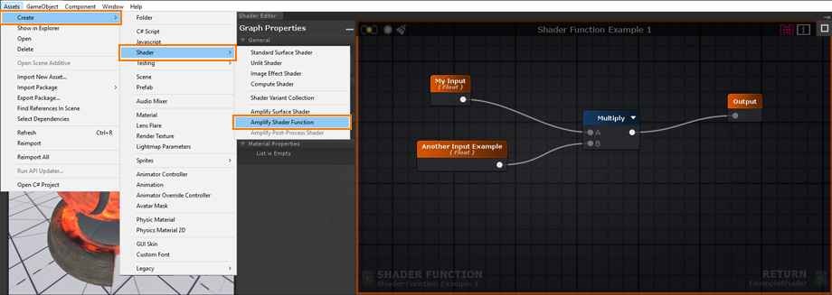

Create a new Shader Function Asset under Assets > Create > Shaders > Amplify Shader Function.

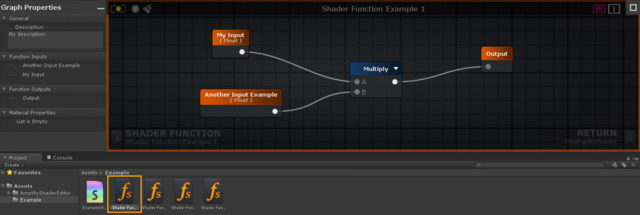

Your newly created Shader Function will be automatically opened in the ASE Editor after being renamed.

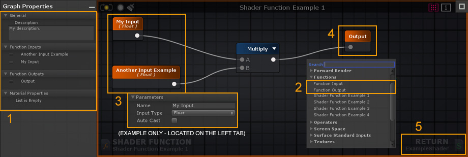

1. Add your Shader Function description here. You can also reorder your Function Inputs/Outputs and Material Properties by dragging them to the desired position. The order set in your SF will be the same used in your Material inspector tab.
2. Create 2 Input nodes or more. By default, there's always 1 Output node but you can add as many as necessary. You can also use other SF nodes inside your active SF but, in order to avoid Shader Function Loops, you cannot add a function to its own canvas.3. 
3. Select an Input node to set the type used or toggle the Auto Cast option to automate the procedure directly in the left tab as you would with any other node properties.4. 
4. Connect your resulting output(s) directly to the Output node(s).5. 
5. Save your changes and click Return to go back to the previously open Shader or Material, if any.

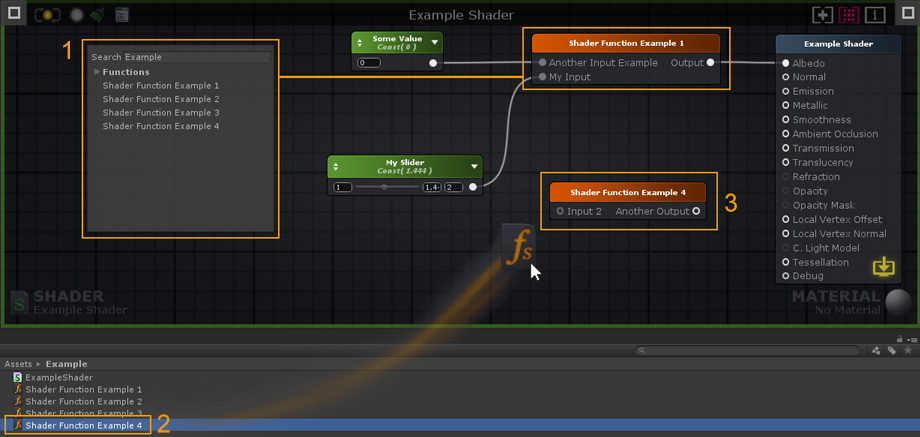

1. Add the created Shader Function to your shader by selecting it directly from the Node List. SF nodes can be used just as any other ASE nodes, they can be duplicated, copied, or deleted.2. 
2. Alternatively, you can drag & drop Shader Functions directly into your editor canvas.3. 
3. Double-click a SF node to open it.

## Hotkeys
---
### Colored Line Mode

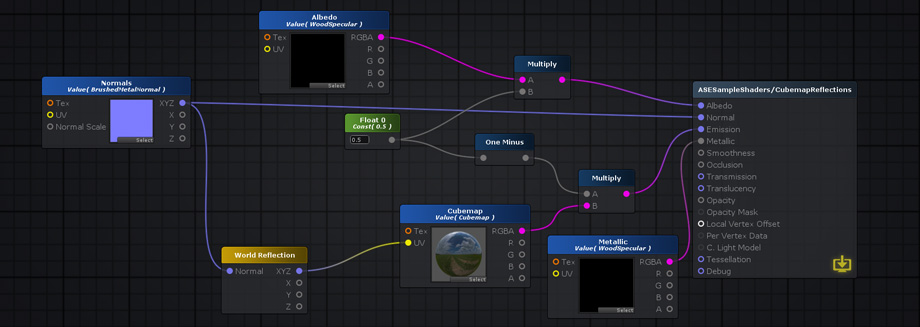 

Press [ W ] to toggle it.

### Node Previews

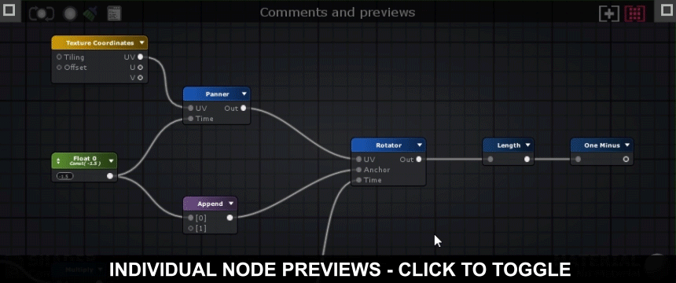 

Press [ P ] to toggle node previewsMulti-line Mod

Press [ CTRL + W ] to activate the multi-line mode.
### Full Shortcut List
**Editor**
- **[Double Click Wire]:** Create wire control point.
- **[F1]:** Open Selected Node Wiki page
- **[C]:** Create Commentary box (groups/grouping/group nodes)
- **[F]:** Focus On Selection
- **[B]:** New Master Node
- **[Space]:** Open Node Palette
- **[W]:** Toggle Colored Line Mode
- **[Control + W]:** Toggle Multi-Line Mode
- **[P]:** Global Preview
- **[Delete]:** Delete selected nodes
- **[Backspace]:** Delete selected nodes
**Nodes**
- Use KEY + Left Mouse Button
- **[Alpha5]:** Color
- **[Alpha0]:** Int
- **[Alpha1]:** Float
- **[Alpha2]:** Vector2
- **[Alpha3]:** Vector3
- **[Alpha4]:** Vector4
- **[L]:** Lerp
- **[N]:** Normalize
- **[O]:** One Minus
- **[E]:** Power
- **[A]:** Add
- **[D]:** Divide
- **[M]:** Multiply
- **[S]:** Subtract
- **[R]:** World Reflection
- **[T]:** Texture Sample
- **[U]:** Texture Coordinates

## Translucency

The Translucency input provides a fast method of representing light scattering. It's not the most realistic method available but it's a flexible and fast-performing approximation. In our example (AmplifyShaderEditor\Examples\Official\Translucency) we use a simple red tinted Depth Texture to represent the skin subsurface scatter effect but you don't necessarily need to use the same setup, you could very well plug a full RGB texture to the Translucency Input in order to get some color variation or stylized results

**The Material Properties below are automatically added to your shader when you plug your values into the Translucency Input Port.**

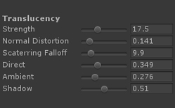

- Strength: Translucency effect strength, you can think of it as a multiplier slider.
- Normal Distortion: Defines the amount of normal distortion on the translucency effect.
- Scattering Falloff: Scattering falloff amount for the translucency effect.
- Direct: Direct light influence on the translucency effect.
- Ambient: GI/ambient light influence on the translucency effect.
- Shadow: Self-shadowing influence on the translucency effect, reduces the translucency effect in shadowed areas.

## Your First shader

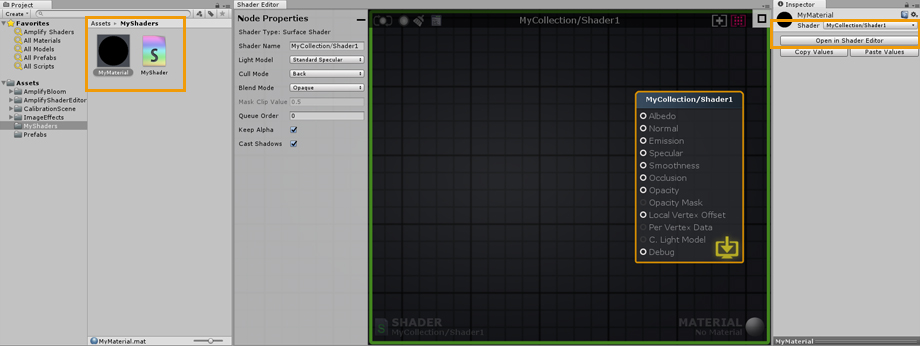 

1. Open the Editor, create a new material and a new shader in the Project Explorer tab. In the newly created material, select your new shader and click on the Open in Shader Editor button to open both the shader and material.

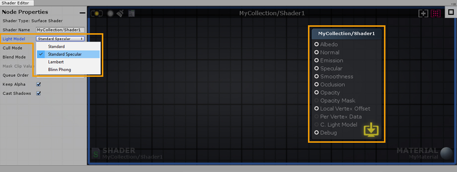 

2. As an example, select the Output Node and change its Light Model to specular.

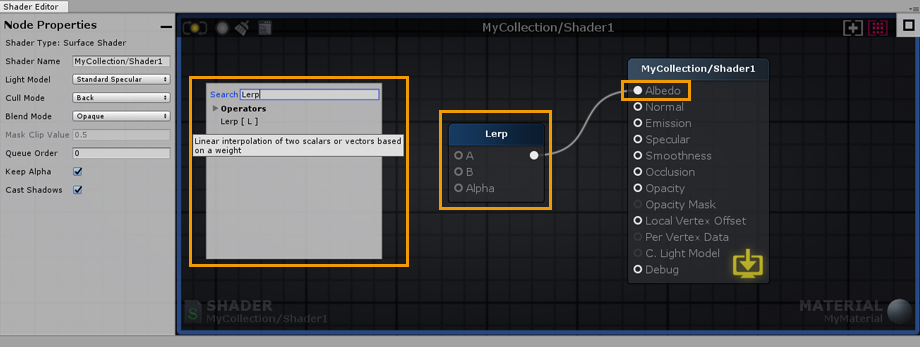 

3. Right click on the canvas to open the searchable node list and type “Lerp”. Click on Lerp and connect the node Output Port to the Albedo Input Port.

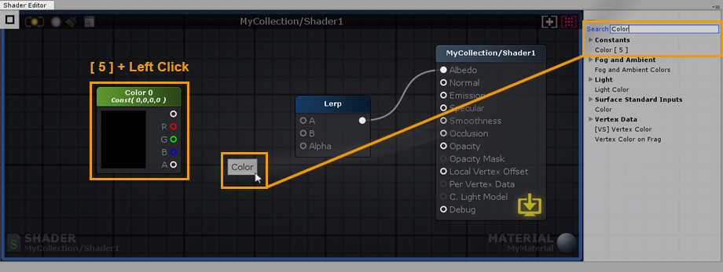 

4. Hold the 5 shortcut key and click on the canvas to create a new Color node. Alternatively, you can use the searchable list used early or drag and drop the node from the Node Palette on the right side; Constants > Color [ 5 ].

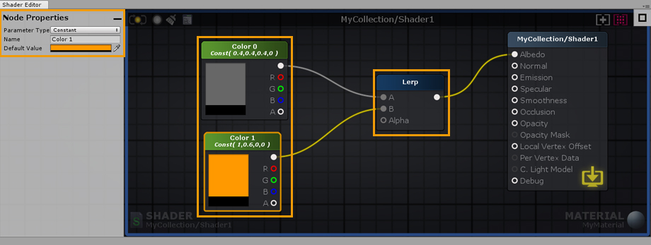 

5. Select the new Color node and hit ‘CTRL/CMD+D’ to duplicate it. Connect both nodes to the Lerp Input Ports. Set the first node to gray and the second one to a more lively color.

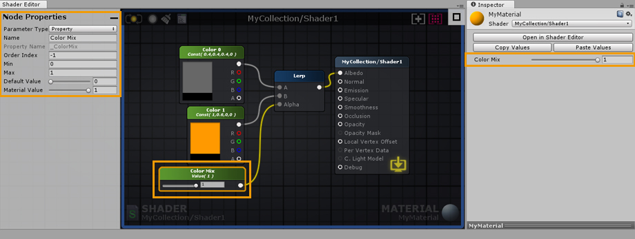

6. Create a Float node by dragging and dropping it from the Node Palette, connect it to the Alpha port of the Lerp node. In the node properties of the newly created float, set its Minimum value to 0 and Maximum to 1. Notice that the Float can now be controlled by a Slider. Don’t forget to set its Parameter Type to Property, this way you will be able to change it directly in the material. You can also name the node and change its position in the material inspector by adjusting the Index value. As an example, lets name it Color Mix.

7. Create a new Float and connect it to the Smoothness Input Port of the Output Node, set its Minimum value to 0 and Maximum to 1 as you did before. Set its type to Property and name it Smoothness Value. Create another Float and connect it to the Specular Input Port, set its Minimum value to 0 and Maximum to 1. Set its Type to Property and name it Specular Value.

8. To conclude, Drag and Drop a Normal Map texture from your Project Explorer directly into the canvas. As an example, we used a Brushed Metal texture. Connect it to the Normal Input Port of the Output Node and you are done. You have just built your first shader, don’t forget to save your work regularly by clicking the Update button located in the upper left corner. Alternatively, you could edit the shader with the LIVE mode enabled, any change are immediately saved and updated. Depending on the complexity of the shader, the LIVE mode may take a second or so to update. Contrary to Default shader values, any changes made to a material property are immediately visible.

 

## 3rd-Party Compatibility

### Aura 2

Using Aura 2 with ASE is quite simple, just add the necessary nodes.

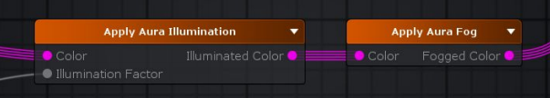

Be sure to check the official Aura 2 Manual for updated information.

### Substance Support

Support for [Substances](https://www.allegorithmic.com/substance) in Unity 2018 and above has been added to ASE.

The original Substance example had to be packaged into a Unity package since .sbsar files now cause an importing error in Unity 2018, as native Substance support has been dropped.

If you're using **pre-Unity 2018** versions where native Substance support wasn't yet deprecated, you can find the Substance Example below:
- Go into the *AmplifyShaderEditor\Examples\Official\Substance* folder
- Extract the **LegacySubstanceExample.unitypackage**

If you're using **Unity 2018**, you'll need to make sure that you install the Allegorithmic Substance plugin before you extract the proper ASE package:
- Download, import and setup the [Substance in Unity](https://assetstore.unity.com/packages/tools/utilities/substance-in-unity-110555?aid=1011lPwI&pubref=Wiki)
- Go into the *AmplifyShaderEditor\Examples\Official\Substance2018* folder
- Extract the **Substance2018.unitypackage**

ASE lets you use substances directly or indirectly from within the editor. The most basic way to use a substance is to literally drag and drop a substance asset inside the editor. A new [Substance Sample](http://wiki.amplify.pt/index.php?title=Unity_Products:Amplify_Shader_Editor/Substance_Sample) node will be created with it's various textures inside that can be used anywhere.

It's possible to set the substance to generate all textures and drag and drop each one of them independently as a regular texture. These will maintain their reference and update accordingly even if you regenerate the textures.

It's also possible to create a generic shader that is used directly in the shader. The only caveat for this is the extra configuration needed in the substance asset to link each texture sample to a generated texture. If a more automatic process is needed the texture sample node can be set to use a property name that matches Unity's default names (ie: _MainTex for albedos, _SpecGlossMap for specular maps, _MetallicGlossMap for metallic maps, _Glossiness for smoothness maps, _BumpMap for normal maps, _OcclusionMap for occlusion maps, _EmissionMap for emission maps, etc) This way the substance asset will detect the property and automatically assign them the correct texture without extra intervention.

### MegaSplat

Native support for ASE is included in [MegaSplat](https://www.assetstore.unity3d.com/en/#!/content/76166?aid=1011lPwI&pubref=Wiki)

### Curved World Shaders

This guide will show you how to integrate [Curved World](https://www.assetstore.unity3d.com/en/#!/content/26165?aid=1011lPwI&pubref=Wiki) with the [Amplify Shader Editor](https://www.assetstore.unity3d.com/en/#!/content/68570?aid=1011lPwI&pubref=Wiki).
You may download a simple example [here](http://amplify.pt/wp-content/download/CurvedWorldSample_ASE.unitypackage).

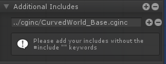

1. For the first step, we're going to include the **curvedworld.cginc** file. In the image above, notice how we added the include with the string: "../cginc/CurvedWorld_Base.cginc", this is because our shader file was in a folder next to the cginc folder where the file is, so the "../" part of the string goes up one folder, the "/cginc/" part looks inside the cginc folder and the last part is the file itself. You could simply use "CurvedWorld_Base.cginc" IF your shader file was next to this file.

*Note: You have to be careful with this inclusion because Unity doesn't let you automatically detect where the file is by name, you have to specify the file path. If you happen to move the file to a different folder you have to fix the file path and recompile the shader again or else it will fail to include the file.* (Alternatively you can also use a project based absolute path: "Assets/VacuumShaders/Curved World/Shaders/cginc/CurvedWorld_Base.cginc". In this case you will only have to fix the path in case you move the Curved World Shader folder.)'

2. Secondly, in order to apply the curved world effect to the object with your shader, you need to call its own Function, which is within the file we included in the first step. To achieve this, you must create and connect a custom expression node into the "local vertex offset" output and have it call the Function you want to call in the code box, which in this case is "V_CW_TransformPointAndNormal(v.vertex, v.normal,v.tangent);". Notice the "Call Mode" checkbox in the parameters panel, it needs to be toggled on in order for this step to work without any issues.

*Note: Should you need to do some vertex transformation, you can still connect it to the input of the Function node.*

That's it! Now you can use everything else like you would in a normal ASE shader and it should work in curved world!

### VertExmotion

The [VertExmotion](https://assetstore.unity.com/packages/tools/animation/vertexmotion-23930?aid=1011lPwI&pubref=Wiki) package includes built-in nodes for ASE. Be sure that the shader name begins with "VertExmotion/", followed by your shader name, else it wont be recognized as being compatible.

1.Unpack the file 'VertExmotion/Addon/VertExmotion_AmplifyShaderEditorNodes.unitypackage'.

2. Add the VertExmotion node and connect it to the Local Vertex Offset Input port.

3. Set the Vertex Output to 'Relative' in the Output Node parameters.

4. Add the VertExmotion cginc file (Assets/VertExmotion/Shaders/VertExmotion.cginc) under Additional Directives, Includes.

5. If you're using tessellation, be sure to add the VertExmotion (Advanced NC) node; plug both the Vertex Offset and Normal to the Output Node inputs. (Optional)

6. HD SRP variant included. (Optional)

## General Tips

### Mobile Shaders

When creating shaders for mobile there are some special considerations to take into account. Usually these considerations are tied to the performance of the shader but sometimes there are artistic or design choices that lead to modifications that are needed at the shader level.

These are just the most common way you may find useful to create shaders for mobile:

#### Rendering Options

Often overlooked, rendering options let you turn off some key feature of unity lighting system. For example, you may find to be enough for your purpose to turn off Unity GI system but still maintaining their PBR workflow.

It this image extreme example every special lighting feature is turned off and even shadows are off. This might not be what what's needed, but it's a good starting point.

#### Custom Lighting Model

**Attention** Custom Lighting is only available for the Universal and Built-in Renderer. Universal Custom Lighting has specific requirements which make use of the "SRP Additional Light" Node, please check this stream and example files for additional details: Dev Stream #4 - [Outline Toon Shading in LW/URP](http://wiki.amplify.pt/index.php?title=Unity_Products:Amplify_Shader_Editor/Tutorials/Amplify_Streams#Amplify_Creations_Dev_Stream_.234_-_Outline_Toon_Shading_in_LW.2FURP)

------

ASE allows the creation of custom lighting model shaders for the built-in renderer. These are still unity surface shaders that allow the replacement of unity lighting functions. In ASE this means you can set your shader Light Model into custom lighting. Doing this will transform the main output node into one that only has emission and opacity ports. With this it's possible to use existing nodes with some extra light nodes to create an optimized and tailor fitted shader for a specific purpose.

The following image shows how it's possible to create a simple wrapped Lambertian shader which should be very performant for lower end machines.  
Nodes used: [Texture Sample](http://wiki.amplify.pt/index.php?title=Unity_Products:Amplify_Shader_Editor/Texture_Sample), [World Normal](http://wiki.amplify.pt/index.php?title=Unity_Products:Amplify_Shader_Editor/World_Normal), [World Space Light Dir](http://wiki.amplify.pt/index.php?title=Unity_Products:Amplify_Shader_Editor/World_Space_Light_Dir), [Dot](http://wiki.amplify.pt/index.php?title=Unity_Products:Amplify_Shader_Editor/Dot), [Multiply](http://wiki.amplify.pt/index.php?title=Unity_Products:Amplify_Shader_Editor/Multiply) [Float](http://wiki.amplify.pt/index.php?title=Unity_Products:Amplify_Shader_Editor/Float), [Add](http://wiki.amplify.pt/index.php?title=Unity_Products:Amplify_Shader_Editor/Add)

Combine this with the previous rendering options for extra savings and do notice how in the general options a few of them where turned off or down for better performance (ie: Shader Model, Precision, Cast Shadows)

As a learning step, it might be a good idea to check the Toon Ramp sample provided by the ASE package which uses custom lighting in a more complex way to create a toon ramp effect with rim light and shadow support.

#### Mobile Friendly Templates

Some times what's needed is a specific vertex/frag shader that does a very simple job, for instance, particles, sprites, UI, etc. For these cases and others ASE allows the injection of shader code into pre-existing shaders that we call "templates". These are regular vertex/frag shaders that were modified by adding some tags the editor can read to know where to inject new code and what code already exists in the template.

There's a whole page dedicated on how these templates work and how you can build your own [right here](http://wiki.amplify.pt/index.php?title=Unity_Products:Amplify_Shader_Editor/Templates).

The reason they might be important for mobile shaders is that these templates can be extremely simple with barely any code at all. If the idea is to save performance, a generic unlit template can serve as a base to build upon since these are editable inside the editor and extra features can be added either by construction a more complex graph tree or by editing the original template. The only caveat being the user must have a bit of shader knowledge to edit or create the original template shader. Fortunately ASE already provides a few templates that any user can pick and use as any other shader.

 
Nodes used: [Template Parameter](http://wiki.amplify.pt/index.php?title=Unity_Products:Amplify_Shader_Editor/Template_Parameter), [Texture Sample](http://wiki.amplify.pt/index.php?title=Unity_Products:Amplify_Shader_Editor/Texture_Sample), [Grayscale](http://wiki.amplify.pt/index.php?title=Unity_Products:Amplify_Shader_Editor/Grayscale), [Float](http://wiki.amplify.pt/index.php?title=Unity_Products:Amplify_Shader_Editor/Float), [Lerp](http://wiki.amplify.pt/index.php?title=Unity_Products:Amplify_Shader_Editor/Lerp)

This feature is still in development and more of these templates will be provided in the future to implement more complex or specific effects when they become available.

### Android

When using the Texture Sampler node in ASE and the target platform is Android, it will ignore the Scale Parameter, which is an intended behaviour because Unity does not scale normal maps for platforms that don't support DXT5nm format, which is the format Unity compresses normal maps into.

Although this can be fixed by directly changing the built-in shader files, which is troublesome to do and to maintain, a simpler solution would be to do the exact same calculation that Unity does withing the editor itself.

The following image and shader file perform this calculation while also making sure that the shader still works even outside of the Android environment by checking the define symbol that Unity sets itself. We recommend that you create a Shader Function with this logic if you need to use it in several shaders.

[Normal Scale in Android](http://amplify.pt/wp-content/download/NormalScaleInAndroid.zip)

