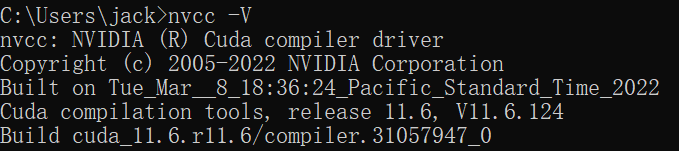
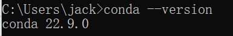
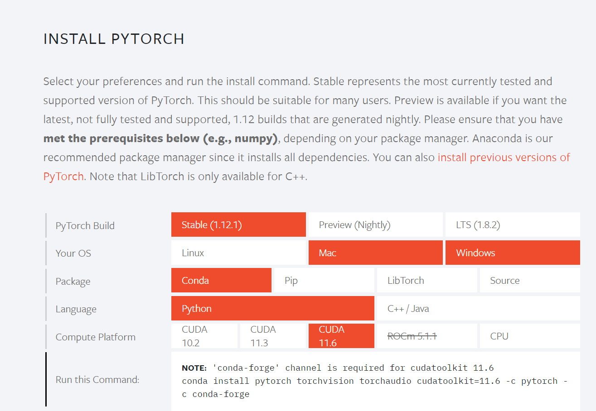
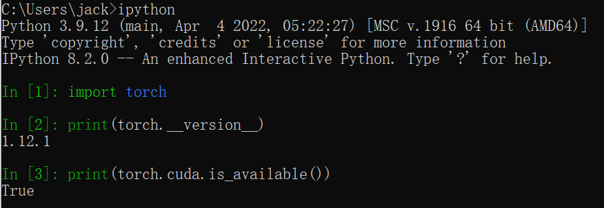
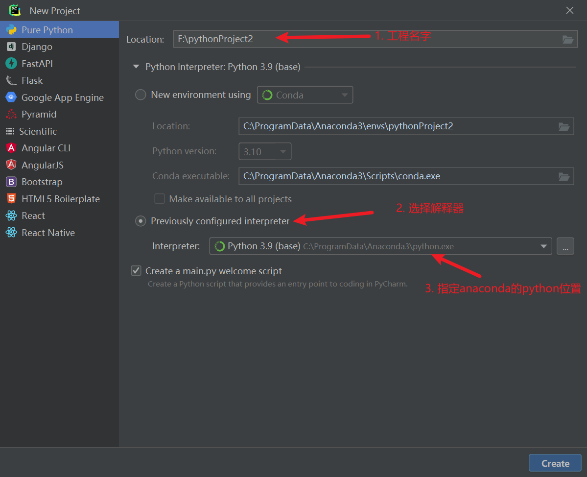
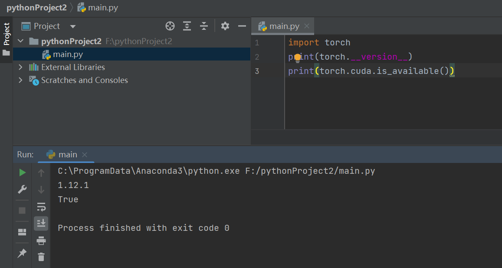

## 如何最快搭建Pytorch环境

请按下面步骤进行，每个部分的测试过了，再往下进行。最折腾人的就是Pytorch的自动下载了。

## 安装CUDA

1. 安装nvidia驱动，cuda 11.6, 因为pytorch目前支持最高为11.6版本。
2. 添加文件夹到系统path中

3. 通过cmd，nvcc -V 查看cuda版本是否正确。


## 安装Anaconda

这里用了最简单的方法，后面将pytorch直接安装到base配置下面了。
1. 下载安装，全部勾选。
2. 一定添加文件夹到path中去，否则后面下载pytorch，无法传输。

3. 通过cmd，输入conda --version ， 测试结果。


## Pytorch


1 最头疼的就是Pytorch的安装，需要配置国内的软件源，然后进行更新。
```
conda config --add channels https://mirrors.tuna.tsinghua.edu.cn/anaconda/pkgs/free/
conda config --add channels https://mirrors.tuna.tsinghua.edu.cn/anaconda/pkgs/main/
conda config --add channels https://mirrors.tuna.tsinghua.edu.cn/anaconda/cloud/conda-forge/
conda config --add channels https://mirrors.tuna.tsinghua.edu.cn/anaconda/cloud/pytorch/
```
2. 为了安装过程中看下载源，可以配置

```
conda config --set show_channel_urls yes
```

以上修改，会在用户的文件夹下面创建.condarc文件，可以打开进行查看。

3. 可以使用下面的命令进行查看以上的配置是否正确：

```
conda config --show-sources
```

4. 安装pytorch ,因为要使用国内源，命令修改成下面的样子（去掉-c pytorch -c conda-forge）

```
conda install pytorch torchvision cudatoolkit=11.6
```



5. 测试

输入ipython和三行测试代码，为True就是正确了。




## PyCharm

1. 安装
2. 新建工程，按下面进行创建。
3. 写测试代码
4. 点击运行




