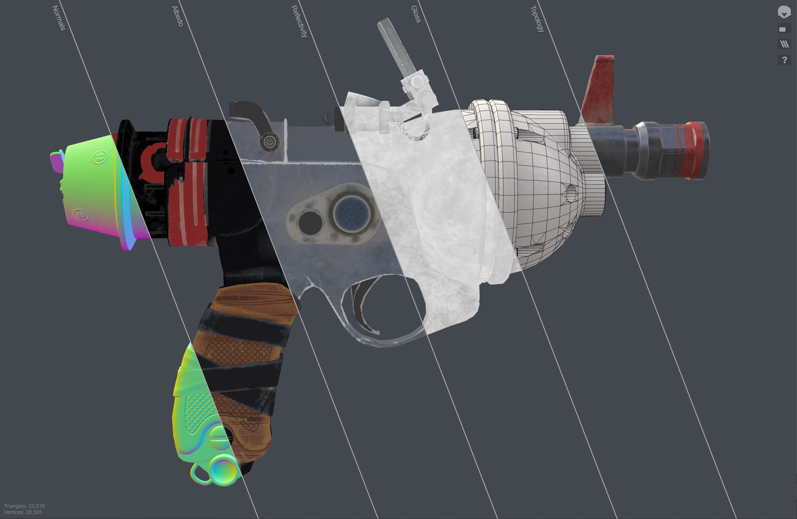
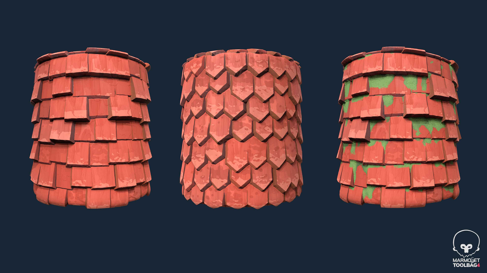

# Game Engines

 

## PBR Workflow

 Here I use the DCC (digtal content creation) tools to model and render a wasteland style gun based on very popular PBR workflow. You can get it from here [[**download**](https://github.com/swang81/MyModels/)]. It contains FBX and all Textures for Unity. 

1. **Modeling:** Use 3D Max to build the low model and use Zbrush to setup high model(with details). Make sure they are aligned.
2. **UV Editing:** Use  3D Max UV tool or RizomUV to unfold low FBX UV.  
3. **Baking:** Import low and high FBX models into Mamoset Toolbag 4 (MT4) and bake the AO, Normal, ID textures. Sometimes use Photoshop to adjust the brightness of AO. MT4 is very useful for Normal baking because its normal brush function is very convenient for some special edges. Input these textures and simple FBX to substance painter(SP).  Bake the rest textures (world space normal, Curvature, position and thickness) in SP. 
4. **Texturing:** Use SP to draw PBR texture. 
5. **Rendering:** In MT4, load all textures and low FBX, place the lights, adjust the camera angle and render the gun. 

## Unity Shader

This is my interesting shader collections. You can get them from here [[**download**](https://github.com/swang81/JackUnityShaders/)]

### PBR Shader

I rewrote the surface shader for practice with the gun model, compared it with the original one and got similar results. It is very friendly for new learners. It has a lot of comments for you. 

### Car Paint Shader

### Cartoon Shader

## Stylized Material with SD
This is a demonstration of the results of the  SD stylized Material practice. Various elements will be added later. 

## Game Demo
### UE4 FPS

<iframe src="//player.bilibili.com/player.html?bvid=BV1bP411k7mN&page=1" scrolling="no" border="0" frameborder="no" framespacing="0" allowfullscreen="true"> </iframe>

### UE VR Laser Sword

<iframe src="//player.bilibili.com/player.html?bvid=BV1Q94y1B7RT&page=1" scrolling="no" border="0" frameborder="no" framespacing="0" allowfullscreen="true"> </iframe>

 
Here we use Oculus Quest 2 + VDS(Virtual Desktop Streamer) + UE4 to build a VR Laser sword demo game.  All logic are base on blueprint. All renderings are done by the host and transmitted through VDS.

