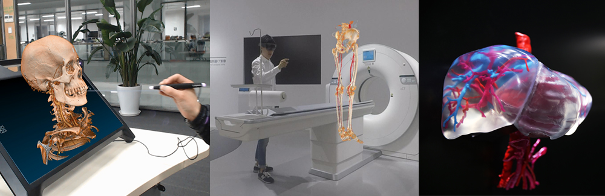

# Projects

 

## Volume Rendering Engine
 

 
Lead the team to develop the core algorithm( Ray-Casting) based on OpenGL/HLSL and optimize the algorithm to meet the requirements of real-time 3D rendering of medical image data and various complex interactive operations , such as splitting, hiding, group,etc.

---

##  Surface Model for Water Drop Animation
 

 
As a postdoctoral researcher, we proposed a deformable surface model to simulate the flow behavior of water droplets on different solid surfaces. In the Lagrangian coordinate system, at each time step, the implicit curvature flow operator is used to simulate the surface tension of water, the contact angle operator is used to change the shape of water droplets on the solid surface, and the topological structure of the mesh is optimized to improve the robustness of the mesh. Through a series of numerical experiments, it is proved that real-time rendering can be achieved.  It was published in IEEE.

---

## VR/AR/3D printing in Medical Image Application

 

 

Lead the team to develop many interesting product prototypes, which is based on VR/AR and 3D printing techniques.  They were  exhibited at the CMEF exhibition and were reported and noticed by the many medias. It can render real medical image data and provide effective supporting for surgical planning. 

---

## Medical Post-Processing Algorithm

 

 

As an algorithm engineer, using C + +, develop colon segmentation algorithms, colon centerline extraction, and colon polyp CAD diagnosis algorithms. Through OpenGL shader language, the algorithm of nerve fiber and brain fusion display is developed. Intel IPP technology is used for acceleration. Relevant algorithms have been integrated into the released products. There are more than 10 related patents.

---

## First principle study of spin-transfer torques

 

 

Recent experiments on the tunneling system and magnetic domain wall call for a full quantum treatment of the whole system. We have developed an efficient first-principles method to calculate spin-transfer torques (STTs) in layered system with noncollinear magnetization. The complete scattering wave function is determined by matching the wave function in the scattering region with the Bloch states in the leads. The STTs are obtained with the aid of the scattering wave function. 

